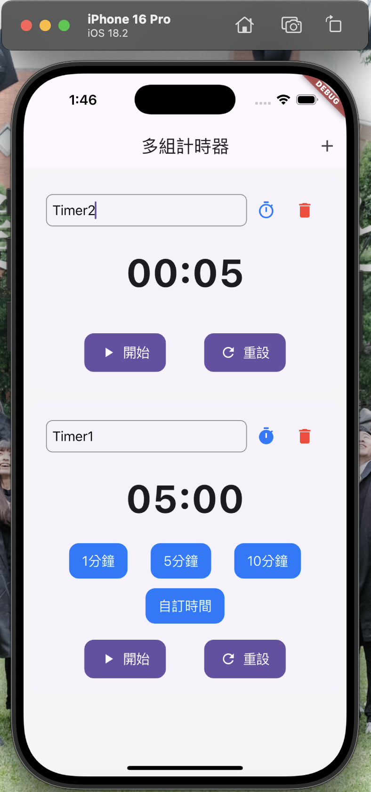

# Flutter Timer App
A modern multi-timer application built with Flutter, featuring both countdown and stopwatch functionalities with a clean, platform-adaptive interface for iOS and Android.

<p align="center">
  
</p>


## Features
### 1. Timer Management
- 1.1. Multiple Independent Timers
- 1.2. Countdown Timer Mode
- 1.3. Stopwatch Mode
- 1.4. Add/Remove Timers Dynamically

### 2. Timer Controls
- 2.1. Start/Pause/Reset
- 2.2. Custom Duration Setting
- 2.3. Quick Preset Times (1min, 5min, 10min)
- 2.4. Timer Name Customization

### 3. UI Features
- 3.1. Platform Adaptive Design (iOS/Android)
- 3.2. Clean and Modern Interface
- 3.3. Responsive Layout
- 3.4. Intuitive Controls
- 3.5. Swipe to Delete Timers

## Requirements
### Development Environment
- Flutter SDK 3.6.1+
- Dart SDK 3.6.1+
- iOS 12.0+ (for iOS deployment)
- Android SDK (for Android deployment)

### Core Dependencies
- flutter/material.dart
- flutter/cupertino.dart
- flutter/services.dart

## Installation and Setup
### General Setup
1. Clone the repository:
```bash
git clone https://github.com/bradykuo/Flutter-Timer-App
cd timer_app
```

2. Get dependencies:
```bash
flutter pub get
```

### Running the Project
1. iOS:
```bash
flutter run -d ios
```

2. Android:
```bash
flutter run -d android
```

## Project Structure
```
timer_app/
│
├── lib/
│   ├── main.dart           # App entry point and theme setup
│   ├── timer_screen.dart   # Main timer list screen
│   ├── timer_model.dart    # Timer logic and state management
│   └── timer_widget.dart   # Timer UI components
│
└── ios/                    # iOS specific configurations
    └── Runner/
        ├── Info.plist
        └── AppFrameworkInfo.plist
```

## Technical Details
### Timer Model Implementation
```dart
class TimerModel extends ChangeNotifier {
  int _duration = 0;
  int _remainingTime = 0;
  bool _isRunning = false;
  Timer? _timer;
  String name = '計時器';
  TimerMode _mode = TimerMode.countdown;
  
  // ... Timer control methods
}
```

### Platform Adaptive UI
```dart
if (Platform.isIOS) {
  return CupertinoButton(
    // iOS style button
  );
} else {
  return ElevatedButton(
    // Material style button
  );
}
```

## Usage Guide
### Basic Operations
1. Launch the application
2. Timer Management:
   - Tap + to add new timer
   - Swipe left/right to delete timer
   - Tap timer mode icon to switch between countdown/stopwatch
3. Timer Controls:
   - Use preset buttons for quick duration setting
   - Tap "自訂時間" for custom duration
   - Start/Pause/Reset controls for each timer

### Features
- Support multiple simultaneous timers
- Platform-specific UI elements
- Customizable timer names
- Custom duration input
- Mode switching between countdown and stopwatch

## Contributing
1. Fork the repository
2. Create your feature branch (`git checkout -b feature/NewFeature`)
3. Commit your changes (`git commit -m 'Add some NewFeature'`)
4. Push to the branch (`git push origin feature/NewFeature`)
5. Open a Pull Request

## License
This project is available for academic and educational purposes.

## Acknowledgments
- Built with Flutter framework
- Design inspired by modern timer applications
- Created as a learning project for Flutter development
